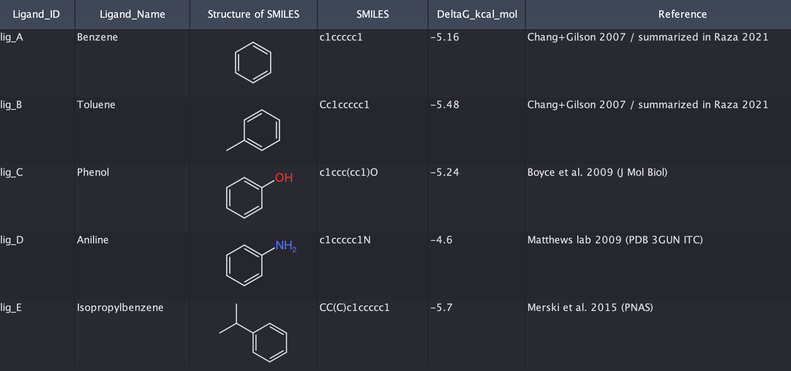
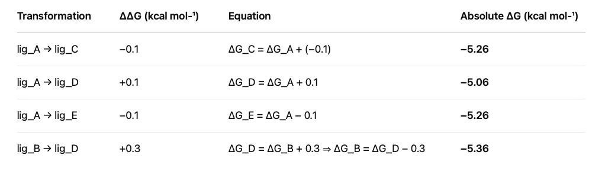
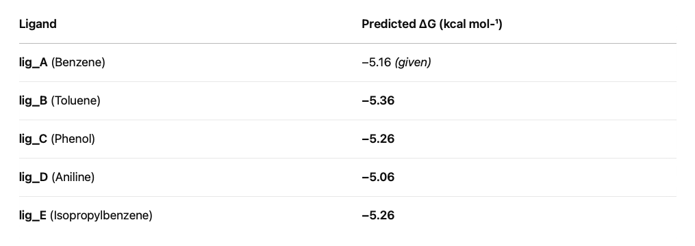

# 🧪 Toy System: L99A Lysozyme + Alkylbenzenes

This folder contains a minimal working example of the full FEP workflow,
from ligand generation to analysis, using a known benchmark system:

- **Protein**: T4 Lysozyme L99A (cavity mutant)
- **Ligands**: Benzene → Toluene → Phenol → Aniline → Isopropylbenzene
- **Binding pocket**: Matches experimental binding data (see `../references/`)

## 📂 Folder Structure

| File | Description |
|------|-------------|
| `protein.pdb` | Raw structure from PDB (e.g., 4W52) |
| `cleaned_protein.pdb` | Output from `prep/clean_protein.py` |
| `lig_A.sdf … lig_E.sdf` | Ligand files can be created via `prep/generate_ligand.py` |
| `ligands.sdf` | All ligands merged into one file (and docked) |
| `charged_ligands.sdf` | All docked ligands with Espaloma partial charges (ML) |
| `transformations.json` | Mappings plus simulation settings for OpenFE |
| `ligand_network.graphml` | Ligand network definition used by OpenFE |
| `easy_rbfe_lig_A_solvent_lig_C_solvent_gpu3.json` | Output for one alchemical transformation |
| `ddg.out` | Example output with relative free energies between compounds |

Below are the ligands, with their experimental binding affinities: 

  

In my FEP calculations, I get the following results for the relative free energy (no error bars due to the lack of repeats, and limited accuracy due to 2ns per leg). Knowing lig_A DG value is -5.16 kcal/mol, we can approximate absolute binding free energies: 

  

The predicted affinity for the compounds is the following:

 

Interpretation:

Some consistency with experiments: Toluene (lig_B) is predicted to bind ~0.2 kcal mol⁻¹ more strongly than benzene (lig_A). Aniline (lig_D) is the weakest of the set by this calculation.

But all compounds fail to impress (in agreement with experiments). In a real drug discovery program, one would be looking for a compound predicted better by more than 1 kcal, and then confirm it with more sampling and more repeats. 
